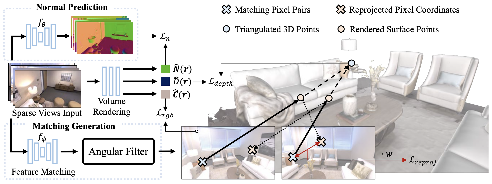

# Sparis
Implementation of AAAI'25 paper *Sparis: Neural Implicit Surface Reconstruction of Indoor Scenes from Sparse Views*

### [Project Page](https://yulunwu0108.github.io/Sparis/) | [Paper](https://arxiv.org/pdf/2501.01196)

## TODO

- [ ] Code release

## Overview

<div align=center>   </div>

In this paper, we propose a new method, named Sparis, for indoor surface reconstruction from sparse views. Specifically, we investigate the impact of monocular priors on sparse scene reconstruction, introducing a novel prior based on inter-image matching information. Our prior offers more accurate depth information while ensuring cross-view matching consistency.

# Citation

If you find our work useful in your research, please consider citing:

```bibtex
@inproceedings{wu2025sparis,
    title={Sparis: Neural Implicit Surface Reconstruction of Indoor Scenes from Sparse Views},
    author={Yulun Wu and Han Huang and Wenyuan Zhang and Chao Deng and Ge Gao and Ming Gu and Yu-Shen Liu},
    booktitle={AAAI Conference on Artificial Intelligence},
    year={2025}
}
```
